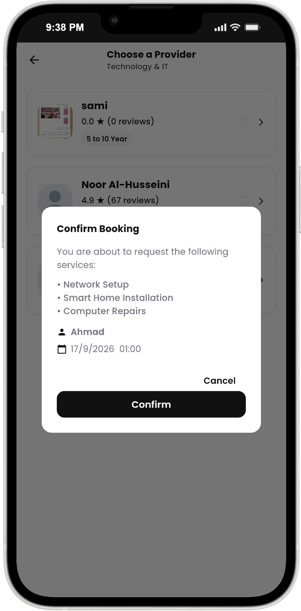
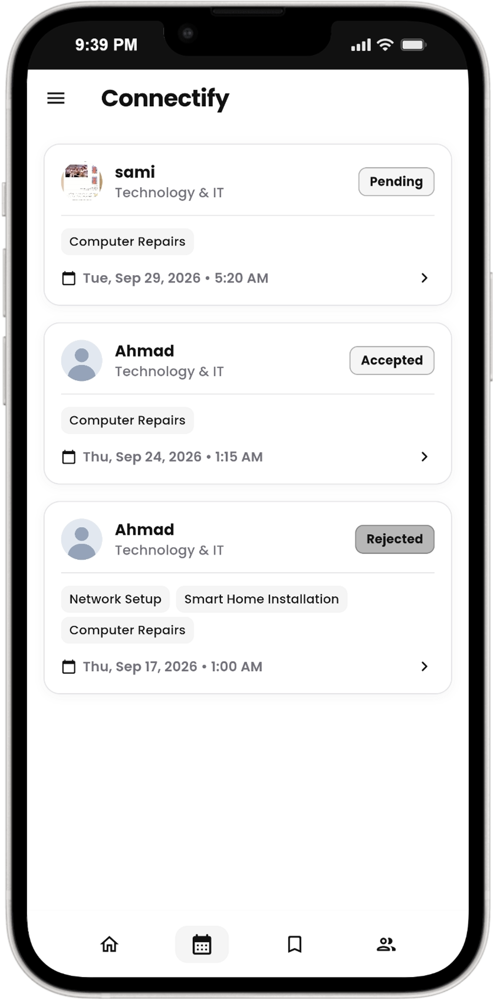
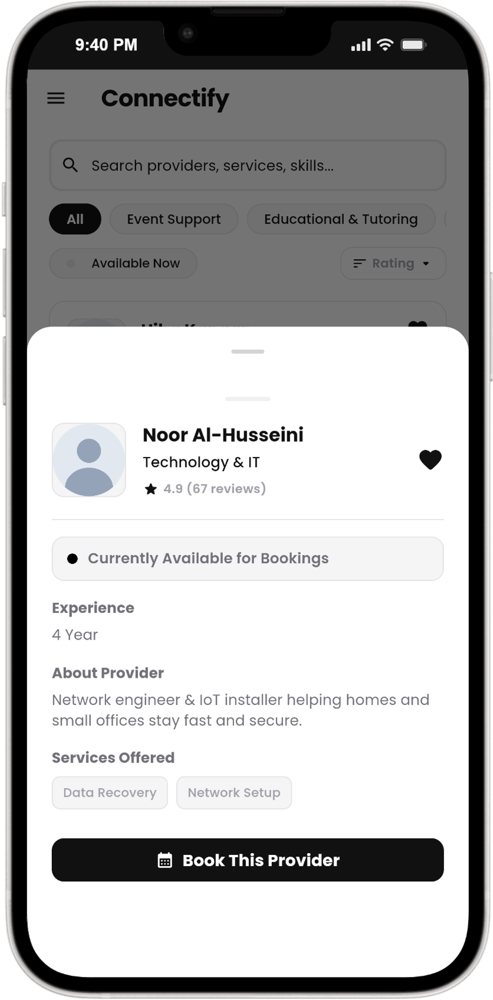
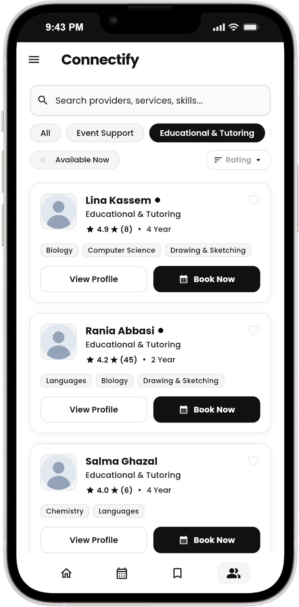
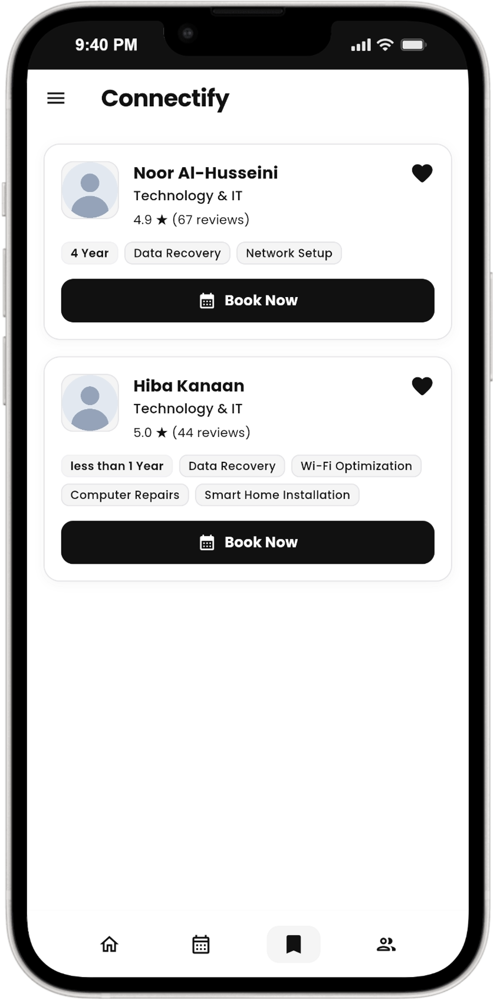
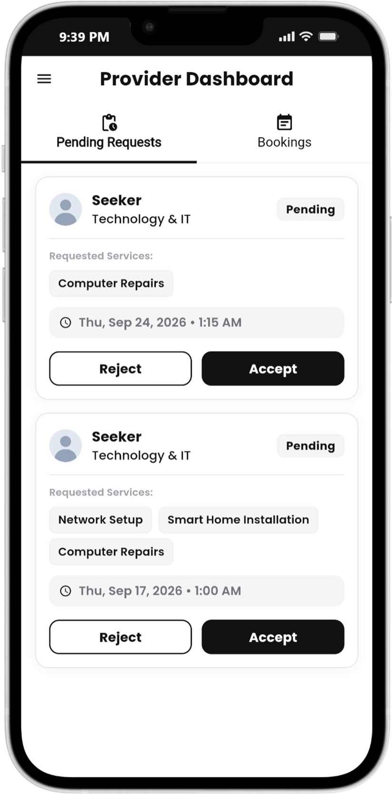
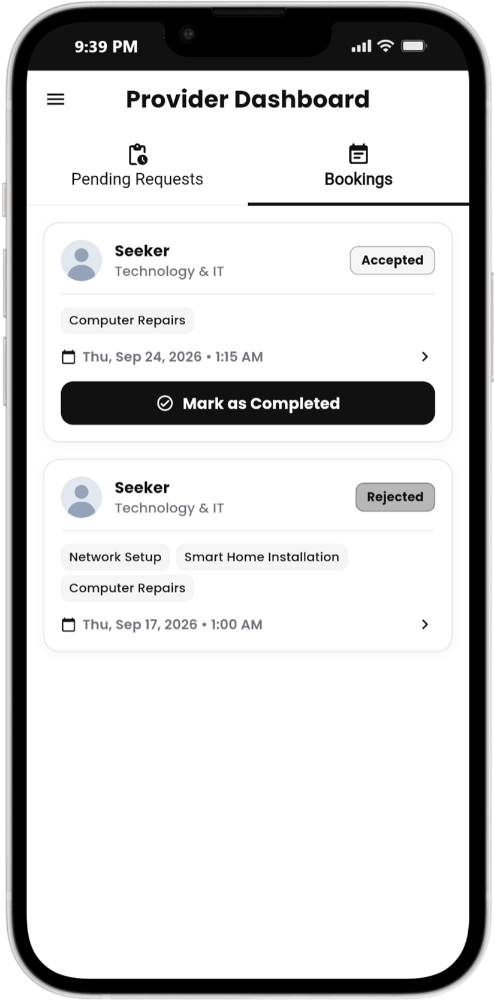
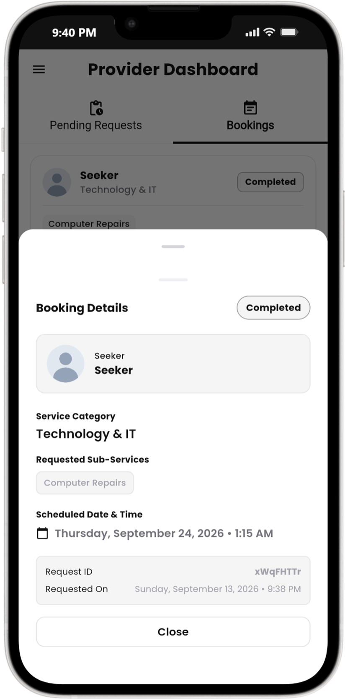

# Connectify

A cross-platform Flutter application that connects users with local service providers. Browse, search, book, and manage services such as cleaning, maintenance, repairs, and more from one app.

## Features

- Onboarding flow - splash screen and guided walkthrough for new users
- Authentication - email/password sign-up, login, and Google Sign-In powered by Firebase Auth
- Service browsing - categorized service listings, sub-service selection, and search
- Booking - select sub-services, schedule date and time, and track request status
- Provider Dashboard - manage incoming service requests, accept/reject jobs, and update status
- Ratings & Reviews - rate providers and submit reviews after service completion
- Bookmarks - save favorite service providers for quick access
- User profiles - profile photo upload via Cloudinary and profile data stored in Cloud Firestore
- Theme modes - Light, Dark, and System theme mode switcher
- AI Chatbot - integrated virtual assistant powered by Google Generative AI (Gemini)
- Push Notifications - notification handling powered by Firebase Cloud Messaging (FCM)
- Help & Support - in-app support page with direct email contact

## Tech Stack

| Layer | Technology |
|---|---|
| Framework | Flutter (Dart) |
| Auth | Firebase Auth & Google Sign-In |
| Database | Cloud Firestore |
| Storage | Cloudinary |
| Push Notifications | Firebase Cloud Messaging (FCM) |
| AI | Google Generative AI (Gemini) |
| Email | Mailer |

## Getting Started

```bash
# Clone the repository
git clone https://github.com/SamiAbuTouq/Connectify.git
cd Connectify

# Install dependencies
flutter pub get

# Run the app
flutter run
```

## Project Structure

```
lib/
├── main.dart                 # App entry point and theme setup
├── routes.dart               # App navigation routes
├── theme.dart                # Light and Dark theme configurations
├── services/                 # Auth, Firestore, Cloudinary, FCM, and Email services
├── onboarding/               # Splash and onboarding screens
├── homepage/
│   ├── models/               # Data models (Services, Bookings, Profiles, Reviews)
│   ├── pages/                # Home, profile, provider dashboard, chatbot, and help pages
│   └── widgets/              # Reusable home and provider widgets
├── views/                    # Login, signup, service selection, and category screens
└── widgets/                  # Shared UI components and theme selector
```

## Screenshots

<p align="center">
  
  
  
</p>

<p align="center">
  
  
  
</p>

<p align="center">
  
  
  
</p>

<p align="center">
  
  
  
</p>

<p align="center">
  
  
  
</p>

<p align="center">
  
  
  
</p>

<p align="center">
  
  
  
</p>

<p align="center">
  
</p>
