# Connectify

A cross-platform Flutter application that connects users with local service providers. Browse, select, and book services such as cleaning, maintenance, and more all from one app.

## Features

- **Onboarding flow** -- splash screen and guided walkthrough for new users
- **Authentication** -- email/password sign-up and login powered by Firebase Auth
- **Service browsing** -- categorized service listings with sub-service selection
- **Booking** -- select one or more sub-services and confirm a booking
- **User profiles** -- profile photo upload (via Cloudinary) and personal info stored in Cloud Firestore
- **AI Chatbot** -- integrated chatbot powered by Google Generative AI
- **Help & Support** -- in-app support page with email contact
- **Payment methods** -- choose from Credit Card, PayPal, Google Pay, Apple Pay, or Bank Transfer

## Tech Stack

| Layer | Technology |
|-------|------------|
| Framework | Flutter (Dart) |
| Auth | Firebase Auth |
| Database | Cloud Firestore |
| Storage | Cloudinary |
| AI | Google Generative AI |
| Animations | animate_do |

## Prerequisites

- Flutter SDK `>=3.5.3`
- A Firebase project with Auth and Firestore enabled
- A Cloudinary account (for image uploads)
- A `.env` file at the project root with the required API keys

## Getting Started

```bash
# Clone the repository
git clone https://github.com/SamiAbuTouq/Connectify.git
cd Connectify

# Install dependencies
flutter pub get

# Run the app
flutter run
```

## Project Structure

```
lib/
├── main.dart                 # App entry point and Firebase init
├── routes.dart               # Named route definitions
├── module/                   # Shared data utilities
├── services/                 # Auth, database, Cloudinary, and email services
├── onboarding/               # Splash, onboarding screens, and transitions
├── homepage/
│   ├── models/               # Service and user profile models
│   ├── pages/                # Home, profile, chatbot, help, and email pages
│   └── widgets/              # Reusable home page widgets
├── views/                    # Login, signup, service selection, and experience screens
└── widgets/                  # Shared UI components (buttons, logos, image picker)
```

---
## Screenshots

<table>
  <tr>
    <td>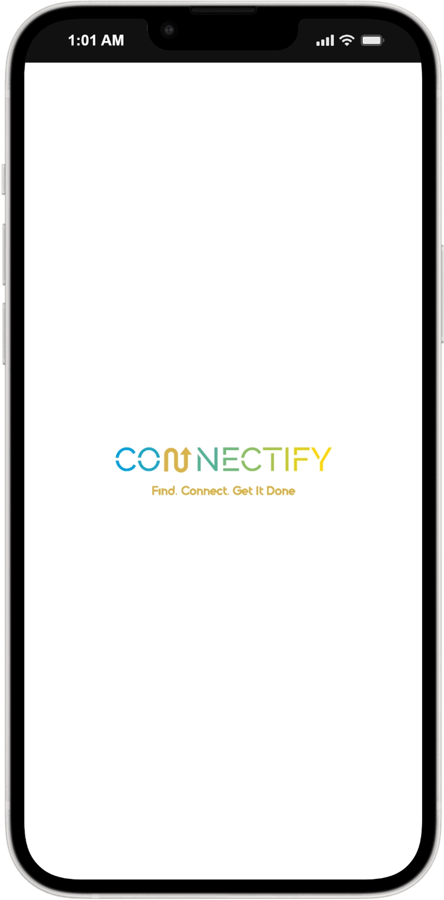</td>
    <td>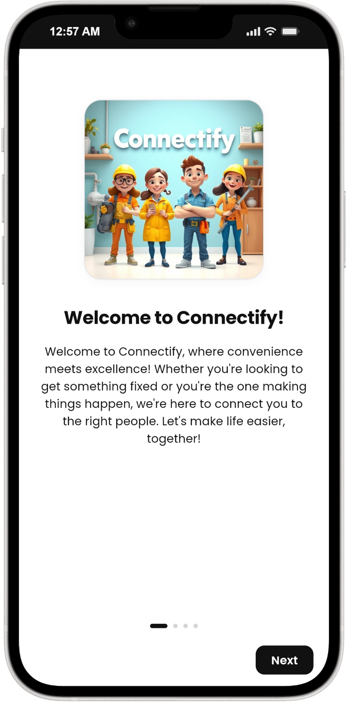</td>
    <td>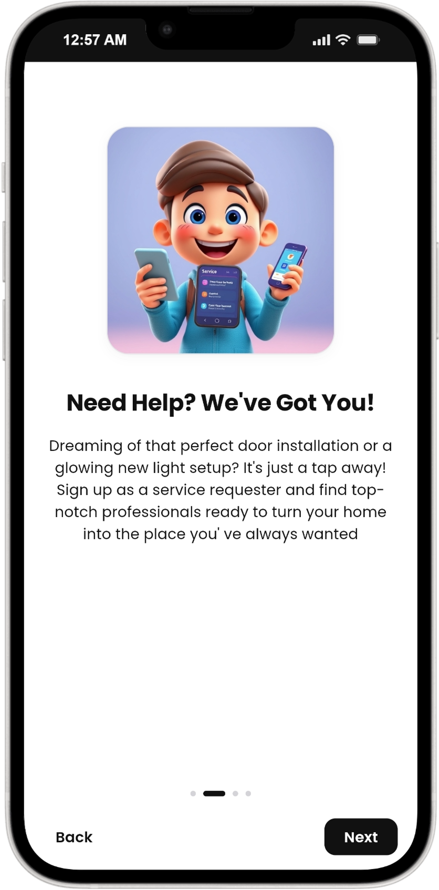</td>
  </tr>
  <tr>
    <td>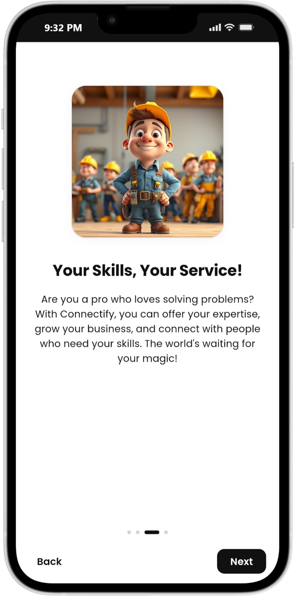</td>
    <td>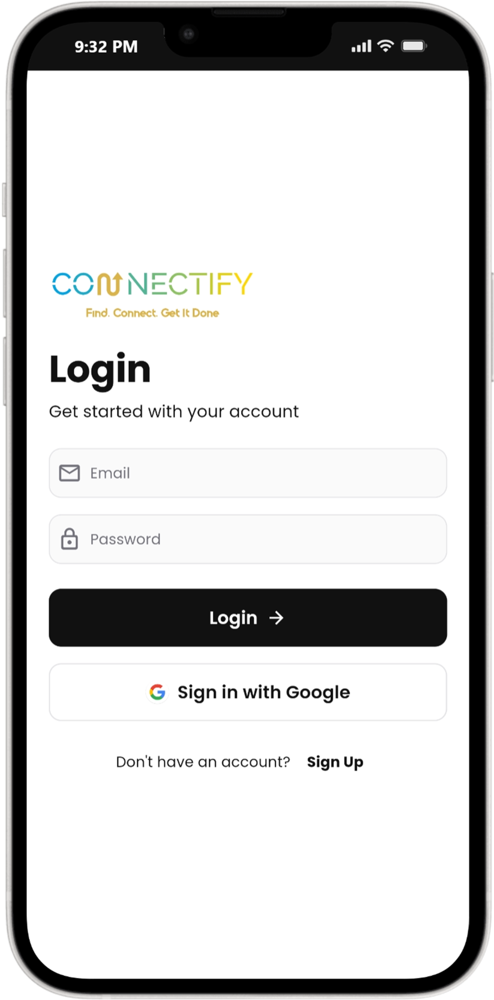</td>
    <td>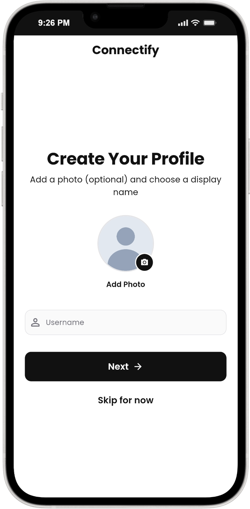</td>
  </tr>
  <tr>
    <td>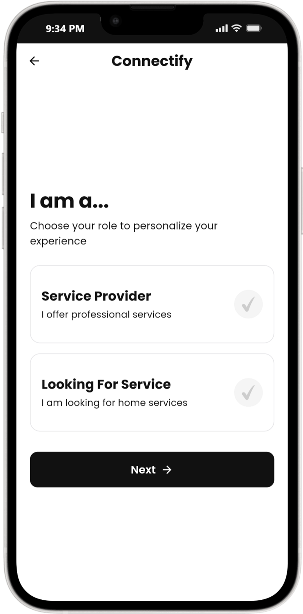</td>
    <td>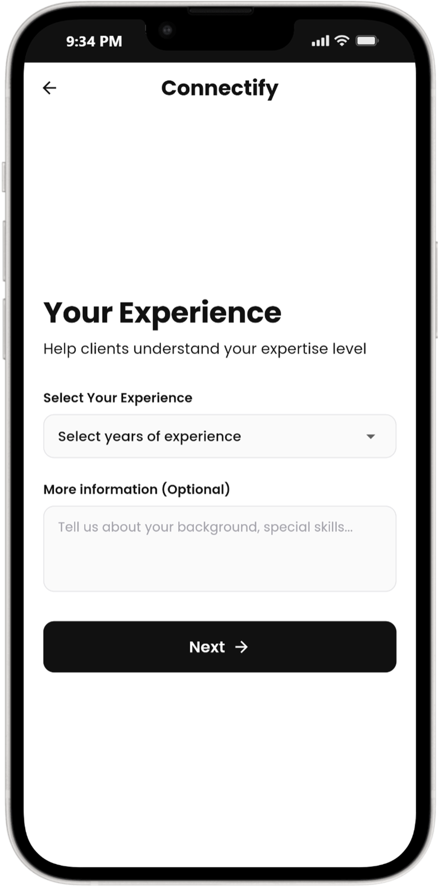</td>
    <td>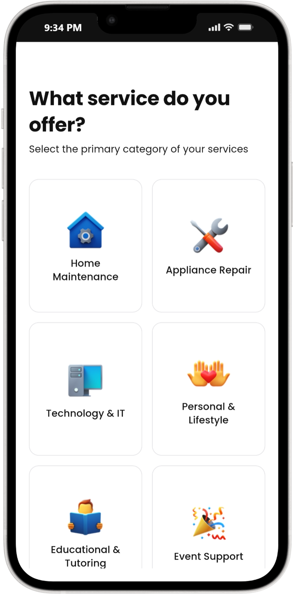</td>
  </tr>
  <tr>
    <td>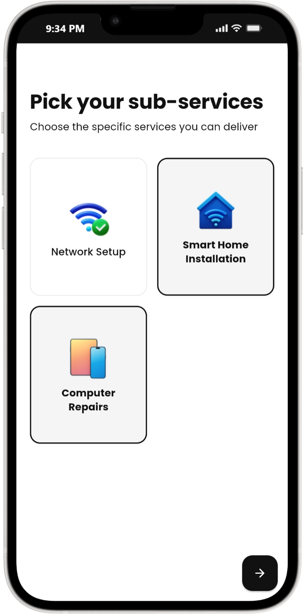</td>
    <td>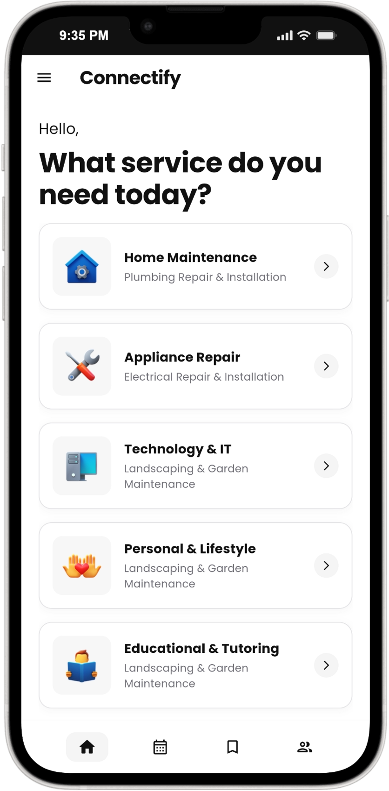</td>
    <td>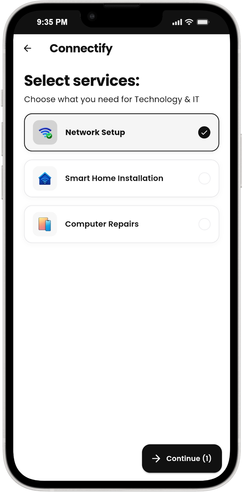</td>
  </tr>
  <tr>
    <td>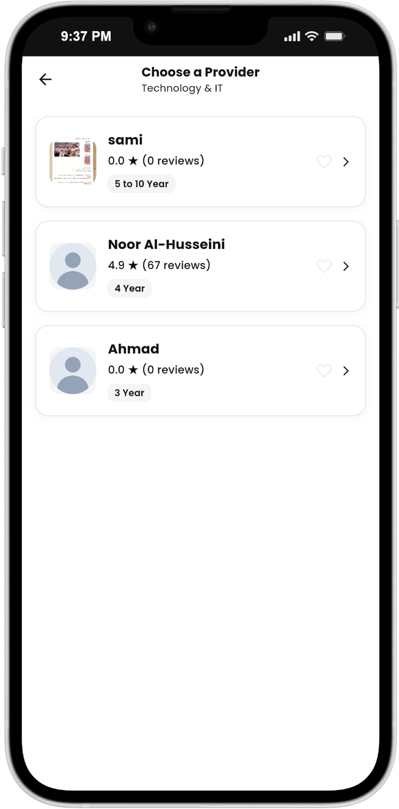</td>
    <td>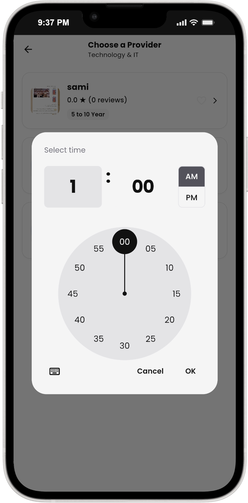</td>
    <td></td>
  </tr>
</table>
